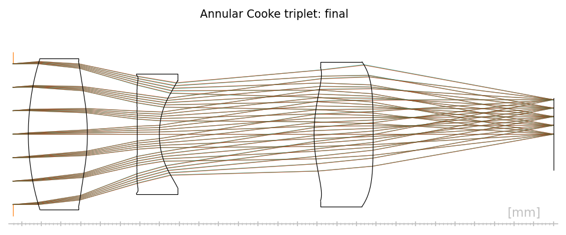

# LM Annular

Differentiable annular optical design with Levenberg–Marquardt optimization and RayWave-compatible scalar wave validation.



LM Annular is a focused derivative of the MIT-licensed EISOPTX project. It keeps the `eisoptx` Python import namespace for compatibility while adding the annular-surface and wave-optics functionality needed for this project.

## What is included

- Differentiable sequential ray tracing with optical-path-length accumulation.
- Piecewise annular refractive surfaces with fixed zone boundaries.
- Harmonic annular topology construction and integer-OPD branch constraints.
- Levenberg–Marquardt optimization of continuous lens and annular parameters.
- Direct scalar Kirchhoff propagation for RayWave-compatible PSF and Strehl checks.
- Reproducible singlet, Cooke-triplet, four-element, and zonal RayWave configurations.
- Core numerical tests for zonal intersections, gradients, OPL, coherent residuals, and RayWave alignment.

The current wave model is a scalar consistency model. It does not model polarization, Fresnel loss, absolute diffraction efficiency, step-sidewall scattering, or a full electromagnetic solution.

## Installation

Python 3.10 or newer is required. For the pinned CUDA environment:

```powershell
conda env create -f environment.yml
conda activate lm-annular
pip install -e .
```

For an existing Python environment, install the package directly:

```powershell
pip install -e ".[dev]"
```

## Quick validation

Run the core suite from the repository root:

```powershell
python -m pytest -q
```

Run the compact zonal RayWave validation:

```powershell
python -m eisoptx.main test `
  -c configs/raywave_zonal/defaults.yml `
  -c configs/raywave_zonal/designs/visible_f100_f2_m480_demo_final.yml `
  -c configs/raywave_zonal/wave.yml
```

## Annular design examples

### Annular singlet

```powershell
python -m eisoptx.main fit `
  -c configs/singlet_achromat/defaults.yml `
  -c configs/singlet_achromat/designs/generated.yml `
  -c configs/singlet_achromat/fit.yml
```

### Cooke triplet

```powershell
$env:SPEC='cooke_triplet'
$env:FOLD_AT='2'
$env:FOLD_FACE='front'
$env:START='configs/multi_element/designs/cooke_f28_baseline_best.yml'
$env:RUN_TAG='cooke_f28_annular_m90'
$env:STAGE_STEPS='800'
python configs/multi_element/demo.py 3 90
```

Reference prescriptions and selected final figures are under `configs/annular_family` and `configs/annular_triplet`. Runtime logs, checkpoints, publication documents, and large experiment arrays are intentionally excluded from this core repository.

## Repository layout

```text
eisoptx/                    Python implementation
configs/raywave_zonal/      RayWave-compatible zonal validation
configs/singlet_achromat/   Annular singlet optimization
configs/multi_element/      Multi-element annular design flow
configs/annular_family/     Reference annular prescriptions
configs/annular_triplet/    Cooke baseline and annular prescriptions
tests/                      Core numerical and regression tests
```

## Upstream and citation

This repository is derived from [EISOPTX / Generalized Aberrations](https://light.princeton.edu/generalized-aberrations). The original MIT license is retained in [LICENSE](LICENSE), and the derivative-work summary is recorded in [NOTICE.md](NOTICE.md).

When publishing results produced with this code, cite the original EISOPTX work and separately describe the annular topology, constrained LM optimization, and RayWave-compatible scalar propagation used here.
