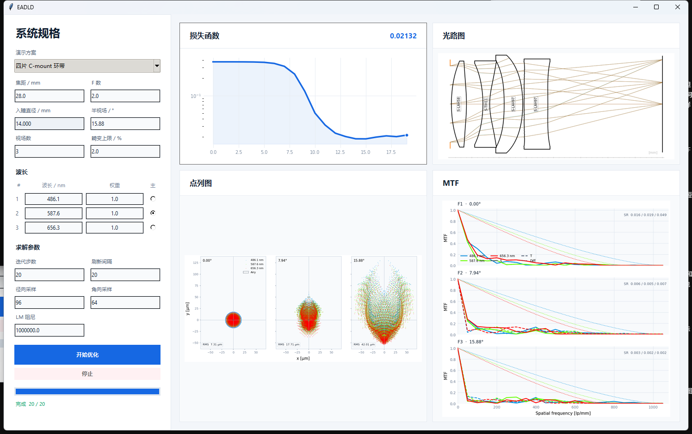

# EADLD

**End-to-End Auto Diffractive Lens Design｜端到端自动衍射镜头设计**

EADLD 将可微几何光线追迹、环带衍射拓扑、受约束 Levenberg–Marquardt（LM）优化和 RayWave 标量波动验证放在同一条设计链中。Python 包名与导入名统一为 `eadld`。

## 原生桌面设计台

EADLD 提供不依赖浏览器的 Windows 原生界面。系统规格区可直接切换旧项目中已经建立的单片、三片和四片工程案例，并设置焦距、F 数、视场、畸变约束和采样参数；波长采用类似 Zemax 的逐行表格，可分别设置权重和主波长。入瞳直径由焦距与 F 数实时计算。



截图为四片初始处方的 20 步实时链路检查，用于展示界面更新与损失下降；归档最终 RMS 以后的独立复算表为准。

```powershell
python -m eadld.desktop
```

默认打开三片 Cooke 环带案例；演示参数打开四片 F/2 C-mount 广角案例：

```powershell
python -m eadld.desktop --demo
```

桌面设计台对应论文补充材料中的三组正式拓扑案例。三片从预精修态复跑 200 步，并保留论文选定的第 100 步处方；四片从离散重铺后的 19 环最终拓扑种子复跑记录中的 750 步连续面型阶段。光路图每个 LM 步都刷新一次，计算量更大的点列图和 RayWave MTF 每 50 步及最终步刷新。

所有最终处方还经过一条不调用优化 merit function 的独立审计：11 个等间隔视场、450–650 nm 九个等权波长、96×32 确定性瞳面采样。表中是加权几何 RMS 点列半径；三线结果、九波长结果和 RayWave 指标不混用。

| 论文案例 | 系统规格 | 搜索选定环带数 | 11×9 均值 RMS / µm | 11×9 最差 RMS / µm | 最小通光率 |
|---|---|---|---:|---:|---:|
| [单片](configs/demo_cases/designs/singlet_final.yml) | EFL 100 mm · F/8 · ±1° | 后表面 M=30，**12 环** | 5.981 | 15.616 | 0.99580 |
| [三片 Cooke](configs/paper_demos/designs/triplet_postrefine_100.yml) | EFL 100 mm · F/2.8 · ±5° | 第二片前表面 M=90，**41 环** | 7.951 | 19.049 | 1.00000 |
| [四片 C-mount](configs/demo_cases/designs/four_element_final.yml) | EFL 28 mm · F/2 · ±15.88° | 第四片前表面 M=30，**19 环** | 3.390 | 8.834 | 0.98655 |

“最优环带数”指各案例在自身孔径、衍射阶次、最小环宽和固定拓扑搜索约束下选定的离散结果，不应跨系统规格解释为通用最优值。

为逐参数重放较早的单片和四片历史，优化阶段保留当时的均匀射线 merit；较新的三片记录使用物理瞳面面积求积。三者的最终验收统一使用上表所述的独立面积加权审计，因此重放兼容模式不会改变报告口径。

本次 EADLD 复跑结果如下。三片第 100 步与论文处方的最大参数差约为 `1e-15`，第 100–200 步最大变化仅 `6.2e-11 mm`；单片和四片因论文归档后核心残差/数值实现发生修复，当前轨迹不再逐参数相同。发布选择始终服从独立最差视场指标，而不是自动采用最后一次运行。

| 案例 | 当前复跑 | 当前 11×9 均值/最差 RMS / µm | 与论文轨迹 | 发布选择 |
|---|---:|---:|---|---|
| 单片 | 200 步 | 15.119 / 40.987 | 数值分叉 | 保留论文归档 5.981 / 15.616 |
| 三片 | 200 步 | 7.951 / 19.049（第 100 步处方） | 参数级复现；100 步后平台 | 采用论文第 100 步 |
| 四片 | 750 步 | 3.310 / 9.233 | 同问题、同 19 环拓扑，绑定后数值分叉 | 保留最差场更优的论文归档 3.390 / 8.834 |

复算命令会同时审计每个参考态与最终态，并把完整 99 节点矩阵写入 `outputs/paper_demos/audit.json`：

```powershell
python examples/audit_paper_demos.py
```

这些归档案例原先以几何像差为优化目标。当前 RayWave 三波长复核表明，它们不能直接宣称为全视场、全波段衍射极限；界面中的 MTF 和 Strehl 是独立波动光学检查，几何 RMS 达标不会替代该检查。角向采样不足时程序会给出警告，MTF 高频端同时受 PSF 网格奈奎斯特频率限制。

优化在独立子进程中运行，界面保持响应，并实时显示：

- 损失函数及其收敛曲线；
- 实时光路图；
- 三视场点列图；每幅叠加三波长颜色和点型，并标注光谱加权 RMS 半径与 Airy 半径；
- 三视场 RayWave MTF；每个波长分别绘制弧矢实线、子午虚线和自身截止频率对应的衍射极限点线。

运行配置和结果保存在 `outputs/desktop/runs/`，该目录不纳入版本管理。

## 核心能力

- 从球面、非球面或近零功率种子自动生成固定环带拓扑。
- 联合优化曲率、厚度、玻璃和环带连续参数。
- 用完整光程差约束保持指定的整数衍射分支。
- 用 RayWave 兼容的直接 Kirchhoff 求和计算 PSF、Strehl 和 MTF。
- 支持单片与多片衍射镜头，核心计算保持 PyTorch 可微。

## 理论模型

第 i 个环带使用四参数局部面型：

$$
zᵢ(r) = (c/2 + ΔA₁,ᵢ)r² + A₂,ᵢr⁴ + ΔZᵢ,  r ∈ (Rᵢ₋₁, Rᵢ].
$$

设计波长 λ₀ 下，相邻环带满足完整系统光程分支：

$$
L̄ᵢ₊₁ − L̄ᵢ = Mλ₀.
$$

RayWave 直接累加各瞳面样本的复振幅：

$$
U(P) = Σⱼ wⱼKⱼ(P) exp(i k Lⱼ(P)),  PSF(P) = |U(P)|².
$$

受约束 LM 先求满足 AΔxₚ = −c 的特解，再在零空间 N 中求：

$$
minᵧ ‖r + J(Δxₚ + Ny)‖₂² + λ‖D(Δxₚ + Ny)‖₂².
$$

## 一阶与二阶优化对比

下表来自相同五个近零功率种子、相同 G+S+C 残差、相同环带拓扑和 300 步预算。数值为几何 RMS 半径；“±”表示种子间样本标准差。该实验中 Adam 的最终 RMS 更低，因此这里展示的是方法差异，不宣称 LM 在所有终点指标上必然占优。

| 方法 | 信息阶次 | 3×3 均值 RMS / µm | 99 节点均值 RMS / µm | 48 节点均值 RMS / µm | 48 节点最差 RMS / µm |
|---|---|---:|---:|---:|---:|
| Adam | 一阶梯度 | 5.195 ± 0.070 | 3.821 ± 0.075 | 3.301 | 5.544 |
| LM | Gauss–Newton 二阶近似 | 5.563 ± 0.096 | 4.260 ± 0.042 | 3.926 | 5.956 |

LM 的主要价值是把曲率信息与硬分支约束放进同一个可行步中；Adam 更轻量，但不直接利用 JᵀJ 或约束零空间。

## CODE V–RayWave PSF 精度

冻结同一环带处方、孔径、采样和像面网格后，CODE V FFT PSF 与 EADLD RayWave 的归一化 PSF NRMSE 分别为 3.50%、3.37% 和 1.79%。


| 波长 / nm | PSF NRMSE | CODE V Strehl | RayWave Strehl | Strehl 绝对差 |
|---:|---:|---:|---:|---:|
| 486.1 | 0.0350 | 0.07694 | 0.07690 | −0.00004 |
| 550.0 | 0.0337 | 0.20753 | 0.20655 | −0.00097 |
| 656.3 | 0.0179 | 0.04831 | 0.04929 | +0.00098 |

这是标量传播一致性验证，不包含偏振、台阶侧壁散射、菲涅耳损耗或绝对衍射效率。

## 多片自动优化示例

下面展示三片 Cooke 基线与第二片前表面环带设计的连续优化过程；项目只保留这一处多片公开示例。公开脚本从已记录的环带初始处方开始执行受约束 LM。


```powershell
python examples/run_multi_element.py
```

## 安装与验证

```powershell
conda env create -f environment.yml; conda activate eadld; pip install -e ".[dev]"
```

```powershell
python -m pytest -q
```

紧凑的 RayWave 检查：

```powershell
python -m eadld.main test -c configs/raywave_zonal/defaults.yml -c configs/raywave_zonal/designs/visible_f100_f2_m480.yml -c configs/raywave_zonal/wave.yml
```

## 目录

```text
eadld/        核心光学、波动传播和优化代码
configs/      三条最小可复现配置链
examples/     面向使用者的简洁入口
tests/        理论、梯度、约束和 RayWave 回归测试
docs/         展示图与验证指标
```

## 来源与许可

EADLD 基于 MIT 许可的 [EISOPTX / Generalized Aberrations](https://light.princeton.edu/generalized-aberrations) 开发。原许可证保留在 [LICENSE](LICENSE)，衍生工作说明见 [NOTICE](NOTICE)。论文使用时应同时引用上游工作，并明确说明 EADLD 的环带拓扑、完整光程分支约束、LM 优化和 RayWave 标量传播。
