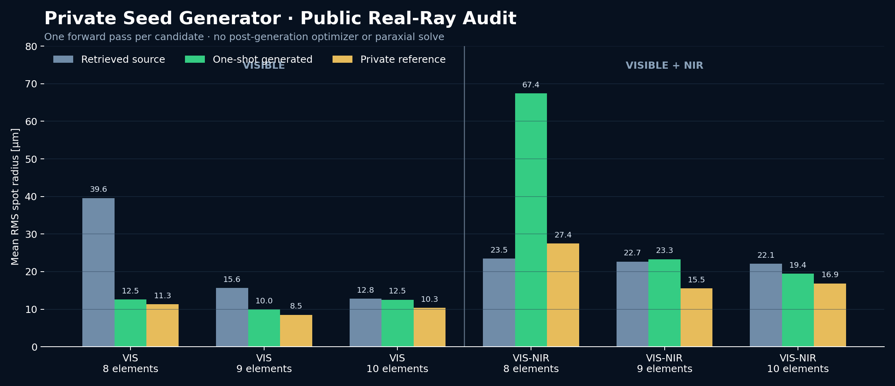

# EADLD

[English](README.md) | **中文**

**端到端自动衍射镜头设计**

EADLD 集成可微光线追迹、环带衍射拓扑、受约束 Levenberg–Marquardt 优化和 RayWave 标量波动分析。

## 演示案例

项目包含单片、Cooke 三片和四片 C-mount 案例。最终指标采用独立的 11 视场 × 9 波长审计和 96×32 确定性瞳面采样。

| 案例 | 系统规格 | 优化环带拓扑 | 均值 RMS / µm | 最差 RMS / µm | 最小通光率 |
|---|---|---|---:|---:|---:|
| [单片](configs/demo_cases/designs/singlet_final.yml) | EFL 100 mm · F/8 · ±1° | 后表面，M=30，**12 环** | 5.981 | 15.616 | 0.99580 |
| [Cooke 三片](configs/paper_demos/designs/triplet_postrefine_100.yml) | EFL 100 mm · F/2.8 · ±5° | 第二片前表面，M=90，**41 环** | 7.951 | 19.049 | 1.00000 |
| [四片 C-mount](configs/demo_cases/designs/four_element_final.yml) | EFL 28 mm · F/2 · ±15.88° | 第四片前表面，M=30，**19 环** | 3.390 | 8.834 | 0.98655 |

```powershell
python examples/audit_paper_demos.py
```

完整 99 节点审计保存在 `outputs/paper_demos/audit.json`。

## 私有生成器，公开物理验证

EADLD 将初始结构生成能力与可复现的物理验证分离。私有后端接收焦距、F/#、视场、
波段、片数和候选数，通过公开的
[`InitialStructureBackend`](eadld/initialization/api.py) 接口返回完整镜头种子；EADLD
负责固定目标 EPD 的机械门、原生真实光线追迹、候选排序，以及带哈希的光路图和点列图。

推理链路严格保持**一次生成**：生成后不调用优化器、不做近轴焦距/像面求解，也不吸附
目录玻璃。网络架构、训练集、教师配对、逐面处方和权重不在本仓库发布。



| 波段 | 片数 | 检索原型 / µm | 一次生成 / µm | 私有参考 / µm | 有效光线 |
|---|---:|---:|---:|---:|---:|
| 435–656 nm | 8 | 39.56 | **12.55** | 11.28 | 97.47% |
| 435–656 nm | 9 | 15.60 | **9.96** | 8.52 | 100.00% |
| 435–656 nm | 10 | 12.79 | **12.53** | 10.33 | 99.63% |
| 435–850 nm | 8 | 23.46 | 67.41 | 27.45 | 95.53% |
| 435–850 nm | 9 | 22.66 | 23.30 | 15.53 | 100.00% |
| 435–850 nm | 10 | 22.10 | **19.41** | 16.86 | 99.77% |

以上是小规模内部教师集上的五视场 EADLD 真实追迹初始结构指标，不代表独立测试集泛化、
成品镜头或外部软件等价性。宽波段 8 片的退化结果被保留，用于明确当前短板。汇总数据见
[`docs/initial_structure_benchmark.json`](docs/initial_structure_benchmark.json)。

代表性的可见光 9 片结果：


私有后端调用方式：

```powershell
python examples/generate_initial_structure.py --efl 74 --f-number 2.8 --half-field 6.17 --wavelengths 435 545.5 656 --elements 9 --candidate-count 3 --min-image-clearance 6.3 --max-package-length 55.5 --max-distortion 0.01 --target-cra 12 --backend private_seed.runtime:create_backend --backend-config D:\private\seed.toml --output-dir outputs\seed_demo
```

## 光学模型

每个环带采用局部面型：

$$
z_i(r)=\left(\frac{c}{2}+\Delta A_{1,i}\right)r^2+A_{2,i}r^4+\Delta Z_i,
\quad r\in(R_{i-1},R_i].
$$

设计波长 $\lambda_0$ 下，相邻环带满足完整系统光程分支：

$$
\bar L_{i+1}-\bar L_i=M\lambda_0.
$$

RayWave 直接累加瞳面复振幅：

$$
U(P)=\sum_j w_jK_j(P)e^{ikL_j(P)},\qquad \mathrm{PSF}(P)=|U(P)|^2.
$$

受约束 LM 在零空间 $N$ 中求可行步：

$$
\min_y\left\|r+J(\Delta x_p+Ny)\right\|_2^2+
\lambda\left\|D(\Delta x_p+Ny)\right\|_2^2,
\qquad A\Delta x_p=-c.
$$

## 一阶与二阶优化

五个相同近零功率种子、相同残差与拓扑、300 步：

| 方法 | 阶次 | 3×3 均值 RMS / µm | 99 节点均值 RMS / µm | 48 节点均值 RMS / µm | 48 节点最差 RMS / µm |
|---|---|---:|---:|---:|---:|
| Adam | 一阶 | 5.195 ± 0.070 | 3.821 ± 0.075 | 3.301 | 5.544 |
| LM | Gauss–Newton | 5.563 ± 0.096 | 4.260 ± 0.042 | 3.926 | 5.956 |

## CODE V–RayWave PSF 验证

CODE V FFT PSF 与 EADLD RayWave 使用相同处方、孔径、采样和像面网格。


| 波长 / nm | PSF NRMSE | CODE V Strehl | RayWave Strehl | Strehl 差值 |
|---:|---:|---:|---:|---:|
| 486.1 | 0.0350 | 0.07694 | 0.07690 | −0.00004 |
| 550.0 | 0.0337 | 0.20753 | 0.20655 | −0.00097 |
| 656.3 | 0.0179 | 0.04831 | 0.04929 | +0.00098 |

## 多片自动优化

公开示例优化 Cooke 三片镜头第二片的环带前表面。


```powershell
python examples/run_multi_element.py
```

## 安装

```powershell
conda env create -f environment.yml
conda activate eadld
pip install -e ".[dev]"
python -m pytest -q
```

RayWave 检查：

```powershell
python -m eadld.main test -c configs/raywave_zonal/defaults.yml -c configs/raywave_zonal/designs/visible_f100_f2_m480.yml -c configs/raywave_zonal/wave.yml
```

## 项目

EADLD 基于 [EISOPTX](https://light.princeton.edu/generalized-aberrations) 开发。
